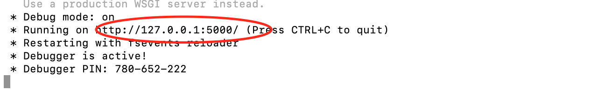
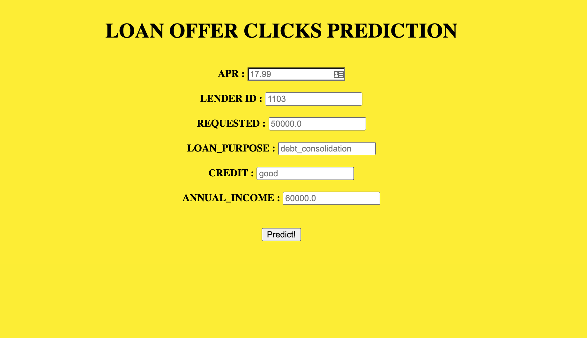
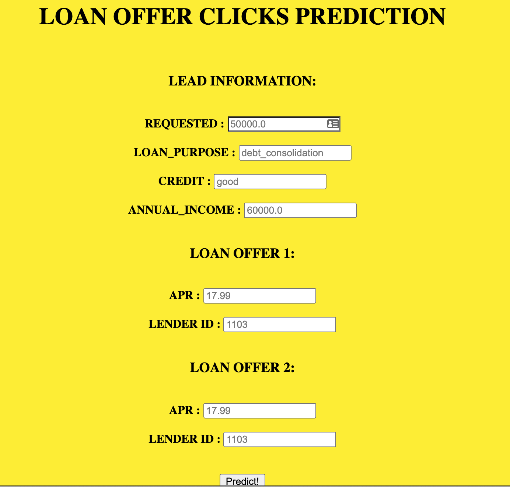

# Loan Offer Clicks Prediction Web App


## Project Description     
    
Built and deployed a loan offer click prediction app that lenders can use to see which loan offer is most likely to get clicked by an applicant. Compared and selected the best model with a ROC curve. Deployed the application using Flask and REST API.    

    
## Project and Environment Setup
    
Go to the terminal, locate your working directory and enter the following command:
    
Clone the repo:     

```
    git clone https://github.com/shabrown/Loan-Offer-Click-Prediction-App.git    
    cd <repodir> 
 ```       
  
   
Set up virtual enviroment:   
  
```
    python3 -m venv env    
    source env/bin/activate    
    deactivate # to deactivate the virtual enviroment     
```
   
Install packages and dependencies:     
    
```
    pip install -r requirements.txt      
```
   
## How to Run the App: 
   
To run the app:
   
1. Open the terminal   
2. Go to the project directory  
3. Use the "ls" command to see if you are able to see the app.py   
4. When you do, run the following command:  
   "python app.py"   
5. If there is no error message, you should see a link to go to the app. Copy and paste the link in your browser.  
     

    
6. You should see the first web app like this: 
      
 
    
7. To go to the second one, simply add "/test" at the end of the web app address (e.g http://127.0.0.1:5000/test) 
       
  
      

**IMPORTANT:**  
   
To ensure the app run smoothly, please select from the following values for these variables:  

lender_id:      
[621, 321, 363, 389, 1992, 240, 1103, 1777, 327, 1737, 2093, 262,
 457, 2108, 417, 237, 383, 386, 311, 1506, 939, 2034, 1828, 2139,
 641, 473]
 
credit:     
['good', 'poor', 'excellent', 'fair', 'limited', 'None', 'unknown']

loan_purpose:     
['home_improvement', 'debt_consolidation', 'other',
 'moving_relocation', 'credit_card_refi', 'large_purchases',
 'medical_dental', 'special_occasion', 'vacation', 'auto', 'taxes',
 'wedding', 'household_expenses', 'business', 'auto_refinance',
 'boat', 'baby', 'student_loan', 'unknown', 'auto_purchase',
 'life_event', 'green', 'car_repair', 'emergency', 'home_purchase',
 'cosmetic', 'motorcycle']
